# [📈 Live Status](https://jmaconsulting.github.io/obiaamonitoring): <!--live status--> **🟩 All systems operational**

This repository contains the open-source uptime monitor and status page for [JMA Consulting](http://jmaconsulting.biz), powered by [Upptime](https://github.com/upptime/upptime).

With [Upptime](https://upptime.js.org), you can get your own unlimited and free uptime monitor and status page, powered entirely by a GitHub repository. We use [Issues](https://github.com/jmaconsulting/obiaamonitoring/issues) as incident reports, [Actions](https://github.com/jmaconsulting/obiaamonitoring/actions) as uptime monitors, and [Pages](https://jmaconsulting.github.io/obiaamonitoring) for the status page.

<!--start: status pages-->
<!-- This summary is generated by Upptime (https://github.com/upptime/upptime) -->
<!-- Do not edit this manually, your changes will be overwritten -->
<!-- prettier-ignore -->
| URL | Status | History | Response Time | Uptime |
| --- | ------ | ------- | ------------- | ------ |
|  [Obiaa](https://obiaa.mainstreetrm.com) | 🟩 Up | [obiaa.yml](https://github.com/JMAConsulting/obiaamonitoring/commits/HEAD/history/obiaa.yml) | 

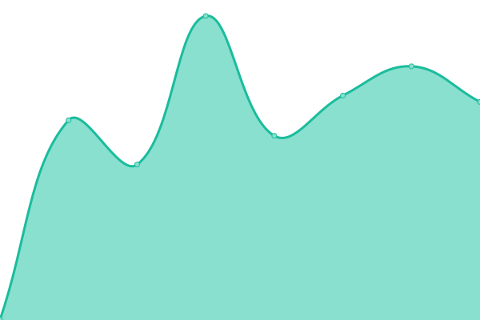 532ms
     
 | 

<a href="https://jmaconsulting.github.io/obiaamonitoring/history/obiaa">100.00%</a>
    

|  [dhbia](https://dhbia.mainstreetrm.com) | 🟩 Up | [dhbia.yml](https://github.com/JMAConsulting/obiaamonitoring/commits/HEAD/history/dhbia.yml) | 

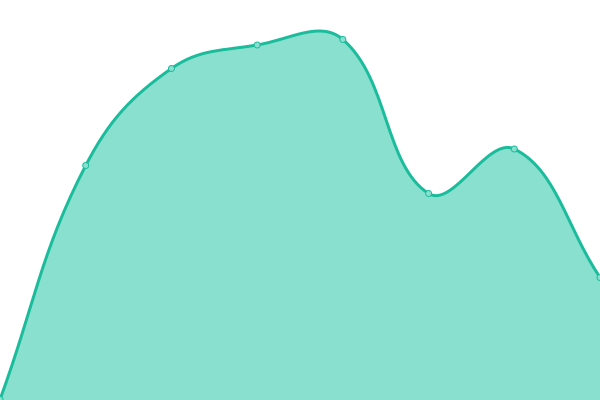 571ms
     
 | 

<a href="https://jmaconsulting.github.io/obiaamonitoring/history/dhbia">100.00%</a>
    

|  [dsbia](https://dsbia.mainstreetrm.com) | 🟩 Up | [dsbia.yml](https://github.com/JMAConsulting/obiaamonitoring/commits/HEAD/history/dsbia.yml) | 

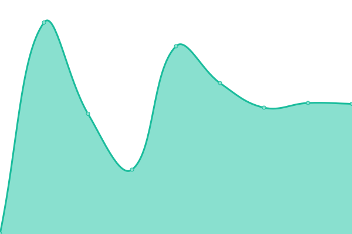 574ms
     
 | 

<a href="https://jmaconsulting.github.io/obiaamonitoring/history/dsbia">100.00%</a>
    

|  [qdbia](https://qdbia.mainstreetrm.com) | 🟩 Up | [qdbia.yml](https://github.com/JMAConsulting/obiaamonitoring/commits/HEAD/history/qdbia.yml) | 

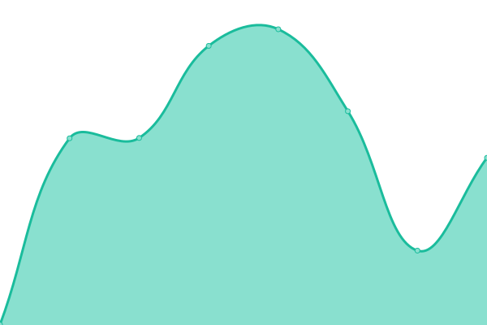 632ms
     
 | 

<a href="https://jmaconsulting.github.io/obiaamonitoring/history/qdbia">100.00%</a>
    

|  [svbia](https://svbia.mainstreetrm.com) | 🟩 Up | [svbia.yml](https://github.com/JMAConsulting/obiaamonitoring/commits/HEAD/history/svbia.yml) | 

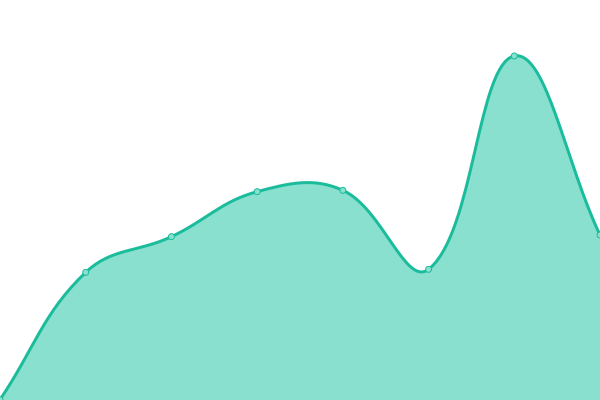 536ms
     
 | 

<a href="https://jmaconsulting.github.io/obiaamonitoring/history/svbia">100.00%</a>
    

|  [wvbia](https://wvbia.mainstreetrm.com) | 🟩 Up | [wvbia.yml](https://github.com/JMAConsulting/obiaamonitoring/commits/HEAD/history/wvbia.yml) | 

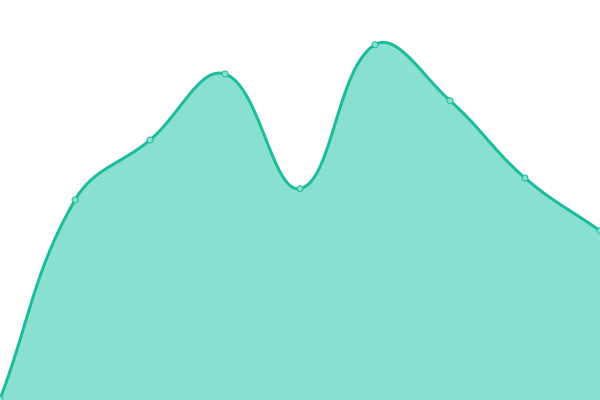 479ms
     
 | 

<a href="https://jmaconsulting.github.io/obiaamonitoring/history/wvbia">100.00%</a>
    

|  [Downtown Carleton Place BIA](https://dcpbia.mainstreetrm.com) | 🟩 Up | [downtown-carleton-place-bia.yml](https://github.com/JMAConsulting/obiaamonitoring/commits/HEAD/history/downtown-carleton-place-bia.yml) | 

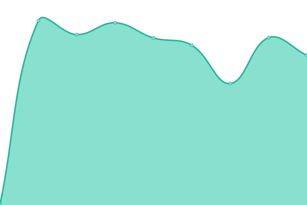 685ms
     
 | 

<a href="https://jmaconsulting.github.io/obiaamonitoring/history/downtown-carleton-place-bia">100.00%</a>
    

|  [dkbia](https://dkbia.mainstreetrm.com) | 🟩 Up | [dkbia.yml](https://github.com/JMAConsulting/obiaamonitoring/commits/HEAD/history/dkbia.yml) | 

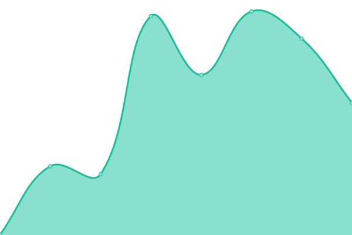 598ms
     
 | 

<a href="https://jmaconsulting.github.io/obiaamonitoring/history/dkbia">100.00%</a>
    

|  [dnbwbia](https://dnbwbia.mainstreetrm.com) | 🟩 Up | [dnbwbia.yml](https://github.com/JMAConsulting/obiaamonitoring/commits/HEAD/history/dnbwbia.yml) | 

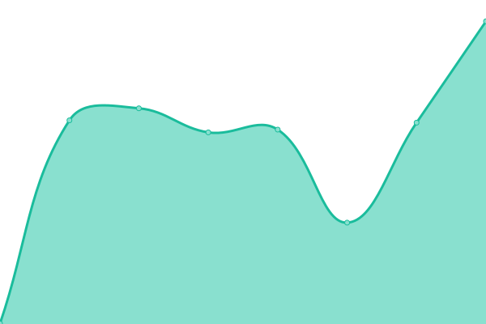 582ms
     
 | 

<a href="https://jmaconsulting.github.io/obiaamonitoring/history/dnbwbia">100.00%</a>
    

|  [hobia](https://hobia.mainstreetrm.com) | 🟩 Up | [hobia.yml](https://github.com/JMAConsulting/obiaamonitoring/commits/HEAD/history/hobia.yml) | 

 691ms
     
 | 

<a href="https://jmaconsulting.github.io/obiaamonitoring/history/hobia">100.00%</a>
    

|  [twdbia](https://twdbia.mainstreetrm.com) | 🟩 Up | [twdbia.yml](https://github.com/JMAConsulting/obiaamonitoring/commits/HEAD/history/twdbia.yml) | 

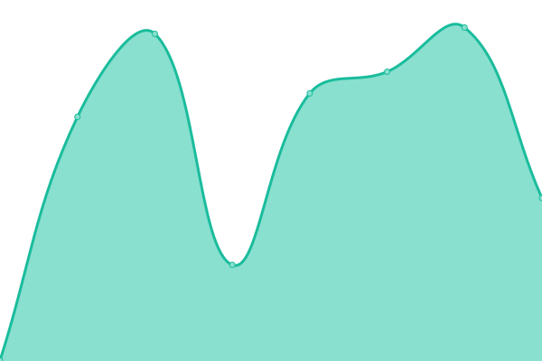 568ms
     
 | 

<a href="https://jmaconsulting.github.io/obiaamonitoring/history/twdbia">100.00%</a>
    

|  [kvbia](https://kvbia.mainstreetrm.com) | 🟩 Up | [kvbia.yml](https://github.com/JMAConsulting/obiaamonitoring/commits/HEAD/history/kvbia.yml) | 

 600ms
     
 | 

<a href="https://jmaconsulting.github.io/obiaamonitoring/history/kvbia">100.00%</a>
    

|  [pdbia](https://pdbia.mainstreetrm.com) | 🟩 Up | [pdbia.yml](https://github.com/JMAConsulting/obiaamonitoring/commits/HEAD/history/pdbia.yml) | 

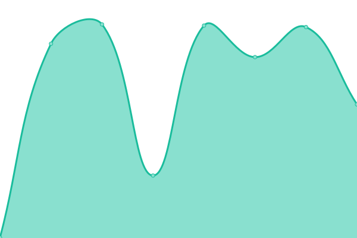 581ms
     
 | 

<a href="https://jmaconsulting.github.io/obiaamonitoring/history/pdbia">100.00%</a>
    

|  [tbia](https://tbia.mainstreetrm.com) | 🟩 Up | [tbia.yml](https://github.com/JMAConsulting/obiaamonitoring/commits/HEAD/history/tbia.yml) | 

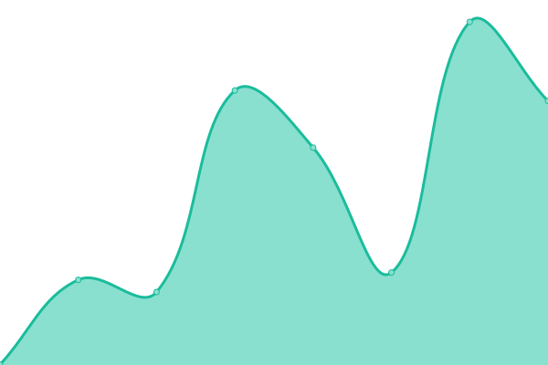 537ms
     
 | 

<a href="https://jmaconsulting.github.io/obiaamonitoring/history/tbia">100.00%</a>
    

|  [dgbia](https://dgbia.mainstreetrm.com) | 🟩 Up | [dgbia.yml](https://github.com/JMAConsulting/obiaamonitoring/commits/HEAD/history/dgbia.yml) | 

 655ms
     
 | 

<a href="https://jmaconsulting.github.io/obiaamonitoring/history/dgbia">100.00%</a>
    

|  [bhbia](https://bhbia.mainstreetrm.com) | 🟩 Up | [bhbia.yml](https://github.com/JMAConsulting/obiaamonitoring/commits/HEAD/history/bhbia.yml) | 

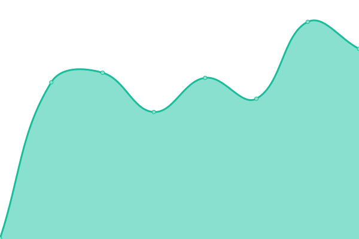 535ms
     
 | 

<a href="https://jmaconsulting.github.io/obiaamonitoring/history/bhbia">100.00%</a>
    

<!--end: status pages-->

[**Visit our status website →**](https://jmaconsulting.github.io/obiaamonitoring)

## 📄 License

- Powered by: [Upptime](https://github.com/upptime/upptime)
- Code: [MIT](./LICENSE) © [JMA Consulting](http://jmaconsulting.biz)
- Data in the `./history` directory: [Open Database License](https://opendatacommons.org/licenses/odbl/1-0/)
