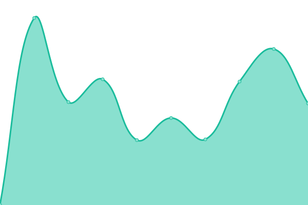
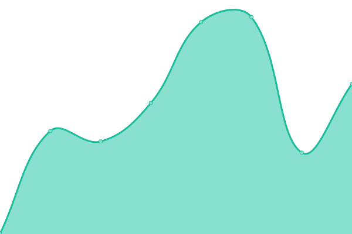
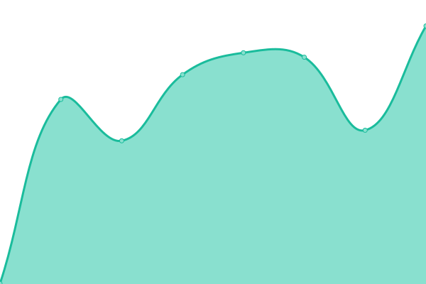

# [📈 Live Status](https://jmaconsulting.github.io/obiaamonitoring): <!--live status--> **🟥 Complete outage**

This repository contains the open-source uptime monitor and status page for [JMA Consulting](http://jmaconsulting.biz), powered by [Upptime](https://github.com/upptime/upptime).

With [Upptime](https://upptime.js.org), you can get your own unlimited and free uptime monitor and status page, powered entirely by a GitHub repository. We use [Issues](https://github.com/jmaconsulting/obiaamonitoring/issues) as incident reports, [Actions](https://github.com/jmaconsulting/obiaamonitoring/actions) as uptime monitors, and [Pages](https://jmaconsulting.github.io/obiaamonitoring) for the status page.

<!--start: status pages-->
<!-- This summary is generated by Upptime (https://github.com/upptime/upptime) -->
<!-- Do not edit this manually, your changes will be overwritten -->
<!-- prettier-ignore -->
| URL | Status | History | Response Time | Uptime |
| --- | ------ | ------- | ------------- | ------ |
|  [Obiaa](https://obiaa.mainstreetrm.com) | 🟥 Down | [obiaa.yml](https://github.com/JMAConsulting/obiaamonitoring/commits/HEAD/history/obiaa.yml) | 

 461ms
     
 | 

<a href="https://jmaconsulting.github.io/obiaamonitoring/history/obiaa">97.10%</a>
    

|  [bbia](https://bbia.mainstreetrm.com) | 🟥 Down | [bbia.yml](https://github.com/JMAConsulting/obiaamonitoring/commits/HEAD/history/bbia.yml) | 

 881ms
     
 | 

<a href="https://jmaconsulting.github.io/obiaamonitoring/history/bbia">97.27%</a>
    

|  [dbbia](https://dbbia.mainstreetrm.com) | 🟥 Down | [dbbia.yml](https://github.com/JMAConsulting/obiaamonitoring/commits/HEAD/history/dbbia.yml) | 

 677ms
     
 | 

<a href="https://jmaconsulting.github.io/obiaamonitoring/history/dbbia">97.32%</a>
    

|  [dhbia](https://dhbia.mainstreetrm.com) | 🟥 Down | [dhbia.yml](https://github.com/JMAConsulting/obiaamonitoring/commits/HEAD/history/dhbia.yml) | 

 459ms
     
 | 

<a href="https://jmaconsulting.github.io/obiaamonitoring/history/dhbia">97.26%</a>
    

|  [dmbia](https://dmbia.mainstreetrm.com) | 🟥 Down | [dmbia.yml](https://github.com/JMAConsulting/obiaamonitoring/commits/HEAD/history/dmbia.yml) | 

 436ms
     
 | 

<a href="https://jmaconsulting.github.io/obiaamonitoring/history/dmbia">97.33%</a>
    

|  [dsbia](https://dsbia.mainstreetrm.com) | 🟥 Down | [dsbia.yml](https://github.com/JMAConsulting/obiaamonitoring/commits/HEAD/history/dsbia.yml) | 

 439ms
     
 | 

<a href="https://jmaconsulting.github.io/obiaamonitoring/history/dsbia">97.36%</a>
    

|  [ldbia](https://ldbia.mainstreetrm.com) | 🟥 Down | [ldbia.yml](https://github.com/JMAConsulting/obiaamonitoring/commits/HEAD/history/ldbia.yml) | 

 374ms
     
 | 

<a href="https://jmaconsulting.github.io/obiaamonitoring/history/ldbia">97.47%</a>
    

|  [qdbia](https://qdbia.mainstreetrm.com) | 🟥 Down | [qdbia.yml](https://github.com/JMAConsulting/obiaamonitoring/commits/HEAD/history/qdbia.yml) | 

 464ms
     
 | 

<a href="https://jmaconsulting.github.io/obiaamonitoring/history/qdbia">97.47%</a>
    

|  [svbia](https://svbia.mainstreetrm.com) | 🟥 Down | [svbia.yml](https://github.com/JMAConsulting/obiaamonitoring/commits/HEAD/history/svbia.yml) | 

 569ms
     
 | 

<a href="https://jmaconsulting.github.io/obiaamonitoring/history/svbia">97.35%</a>
    

|  [wvbia](https://wvbia.mainstreetrm.com) | 🟥 Down | [wvbia.yml](https://github.com/JMAConsulting/obiaamonitoring/commits/HEAD/history/wvbia.yml) | 

 401ms
     
 | 

<a href="https://jmaconsulting.github.io/obiaamonitoring/history/wvbia">97.37%</a>
    

|  [bhbia](https://bhbia.mainstreetrm.com) | 🟥 Down | [bhbia.yml](https://github.com/JMAConsulting/obiaamonitoring/commits/HEAD/history/bhbia.yml) | 

 519ms
     
 | 

<a href="https://jmaconsulting.github.io/obiaamonitoring/history/bhbia">97.39%</a>
    

|  [dcbia](https://dcbia.mainstreetrm.com) | 🟥 Down | [dcbia.yml](https://github.com/JMAConsulting/obiaamonitoring/commits/HEAD/history/dcbia.yml) | 

 412ms
     
 | 

<a href="https://jmaconsulting.github.io/obiaamonitoring/history/dcbia">97.47%</a>
    

|  [Downtown Carleton Place BIA](https://dcpbia.mainstreetrm.com) | 🟥 Down | [downtown-carleton-place-bia.yml](https://github.com/JMAConsulting/obiaamonitoring/commits/HEAD/history/downtown-carleton-place-bia.yml) | 

 513ms
     
 | 

<a href="https://jmaconsulting.github.io/obiaamonitoring/history/downtown-carleton-place-bia">97.31%</a>
    

|  [dkbia](https://dkbia.mainstreetrm.com) | 🟥 Down | [dkbia.yml](https://github.com/JMAConsulting/obiaamonitoring/commits/HEAD/history/dkbia.yml) | 

 406ms
     
 | 

<a href="https://jmaconsulting.github.io/obiaamonitoring/history/dkbia">97.32%</a>
    

|  [dnbwbia](https://dnbwbia.mainstreetrm.com) | 🟥 Down | [dnbwbia.yml](https://github.com/JMAConsulting/obiaamonitoring/commits/HEAD/history/dnbwbia.yml) | 

 529ms
     
 | 

<a href="https://jmaconsulting.github.io/obiaamonitoring/history/dnbwbia">97.34%</a>
    

|  [dwbia](https://dwbia.mainstreetrm.com) | 🟥 Down | [dwbia.yml](https://github.com/JMAConsulting/obiaamonitoring/commits/HEAD/history/dwbia.yml) | 

 729ms
     
 | 

<a href="https://jmaconsulting.github.io/obiaamonitoring/history/dwbia">97.36%</a>
    

|  [hobia](https://hobia.mainstreetrm.com) | 🟥 Down | [hobia.yml](https://github.com/JMAConsulting/obiaamonitoring/commits/HEAD/history/hobia.yml) | 

 1915ms
     
 | 

<a href="https://jmaconsulting.github.io/obiaamonitoring/history/hobia">97.36%</a>
    

|  [scbia](https://scbia.mainstreetrm.com) | 🟥 Down | [scbia.yml](https://github.com/JMAConsulting/obiaamonitoring/commits/HEAD/history/scbia.yml) | 

 433ms
     
 | 

<a href="https://jmaconsulting.github.io/obiaamonitoring/history/scbia">97.48%</a>
    

|  [twdbia](https://twdbia.mainstreetrm.com) | 🟥 Down | [twdbia.yml](https://github.com/JMAConsulting/obiaamonitoring/commits/HEAD/history/twdbia.yml) | 

 406ms
     
 | 

<a href="https://jmaconsulting.github.io/obiaamonitoring/history/twdbia">97.48%</a>
    

|  [btbia](https://btbia.mainstreetrm.com) | 🟥 Down | [btbia.yml](https://github.com/JMAConsulting/obiaamonitoring/commits/HEAD/history/btbia.yml) | 

 491ms
     
 | 

<a href="https://jmaconsulting.github.io/obiaamonitoring/history/btbia">97.48%</a>
    

|  [dgbia](https://dgbia.mainstreetrm.com) | 🟥 Down | [dgbia.yml](https://github.com/JMAConsulting/obiaamonitoring/commits/HEAD/history/dgbia.yml) | 

 427ms
     
 | 

<a href="https://jmaconsulting.github.io/obiaamonitoring/history/dgbia">97.37%</a>
    

|  [dlbia](https://dlbia.mainstreetrm.com) | 🟥 Down | [dlbia.yml](https://github.com/JMAConsulting/obiaamonitoring/commits/HEAD/history/dlbia.yml) | 

 422ms
     
 | 

<a href="https://jmaconsulting.github.io/obiaamonitoring/history/dlbia">97.48%</a>
    

|  [dpbia](https://dpbia.mainstreetrm.com) | 🟥 Down | [dpbia.yml](https://github.com/JMAConsulting/obiaamonitoring/commits/HEAD/history/dpbia.yml) | 

 437ms
     
 | 

<a href="https://jmaconsulting.github.io/obiaamonitoring/history/dpbia">97.48%</a>
    

|  [kvbia](https://kvbia.mainstreetrm.com) | 🟥 Down | [kvbia.yml](https://github.com/JMAConsulting/obiaamonitoring/commits/HEAD/history/kvbia.yml) | 

 464ms
     
 | 

<a href="https://jmaconsulting.github.io/obiaamonitoring/history/kvbia">97.48%</a>
    

|  [pdbia](https://pdbia.mainstreetrm.com) | 🟥 Down | [pdbia.yml](https://github.com/JMAConsulting/obiaamonitoring/commits/HEAD/history/pdbia.yml) | 

 494ms
     
 | 

<a href="https://jmaconsulting.github.io/obiaamonitoring/history/pdbia">97.47%</a>
    

|  [vbia](https://vbia.mainstreetrm.com) | 🟥 Down | [vbia.yml](https://github.com/JMAConsulting/obiaamonitoring/commits/HEAD/history/vbia.yml) | 

 436ms
     
 | 

<a href="https://jmaconsulting.github.io/obiaamonitoring/history/vbia">97.47%</a>
    

<!--end: status pages-->

[**Visit our status website →**](https://jmaconsulting.github.io/obiaamonitoring)

## 📄 License

- Powered by: [Upptime](https://github.com/upptime/upptime)
- Code: [MIT](./LICENSE) © [JMA Consulting](http://jmaconsulting.biz)
- Data in the `./history` directory: [Open Database License](https://opendatacommons.org/licenses/odbl/1-0/)
